# Nano Notion Feeder 🚀

> Transform your documents into beautifully organized Notion pages with intelligent categorization and comprehensive Markdown support

[](https://github.com/your-repo/nano-notion-feeder)
[](https://developers.notion.com)
[](https://modelcontextprotocol.io)
[](https://www.typescriptlang.org)

## ✨ What Makes This Special

**Nano Notion Feeder** is a production-ready nanoservice that seamlessly bridges AI conversations with Notion knowledge management. It intelligently processes documents, automatically categorizes them, and preserves rich Markdown formatting in your Notion workspace.

### 🎯 Key Features

- **🧠 Intelligent Categorization**: Automatically detects embedded categories or prompts users via MCP
- **📝 Rich Markdown Support**: Preserves headings, code blocks, lists, quotes, and formatting
- **🔄 Smart Workflow Routing**: Direct save for categorized content, interactive prompts for uncategorized
- **🎨 Beautiful User Experience**: Friendly prompts, clear success messages, helpful error guidance
- **⚡ Production Ready**: Comprehensive error handling, type safety, and robust architecture
- **🤖 Claude Desktop Ready**: Perfect MCP integration for seamless AI workflows

## 🚀 Live Demo Results

Here's what the system accomplished during our testing:

```bash
✓ Interactive Prompt: 8 categories fetched from real database
✓ Direct Save: https://www.notion.so/20391b129ac881ddac73efb943e45616
✓ Interactive Save: https://www.notion.so/20391b129ac881d48e2ce2d6582cb5b2
✓ Markdown Features: Headers, code blocks, lists, quotes - all perfect
✓ Categories: "Development" and "Research" applied correctly
✓ Titles: "Test Direct Save" and "Complete Test Document" generated automatically
```

## 🏗️ Architecture Overview

```mermaid
graph TD
    A[User Input] --> B[document-to-notion Router]
    B --> C{Has Category?}
    C -->|Yes| D[notion-direct-save]
    C -->|No| E[notion-interactive-save]
    D --> F[CategoryParser]
    E --> G[NotionDatabaseSchema]
    G --> H[UserPromptComposer]
    H --> I[MCP Prompt]
    I --> J[CategorySelectionHandler]
    F --> K[TitleGenerator]
    J --> K
    K --> L[MarkdownToNotionConverter]
    L --> M[NotionPageCreator]
    M --> N[ResponseFormatter]
    N --> O[✅ Success Response]
```



### Three-Workflow Architecture

1. **🎯 Router** (`document-to-notion`): Intelligently analyzes input and routes to appropriate workflow
2. **⚡ Direct Save** (`notion-direct-save`): Processes documents with embedded categories
3. **💬 Interactive Save** (`notion-interactive-save`): Handles category selection via MCP prompts

### Nine Specialized Nodes

1. **WorkflowCaller**: HTTP-based workflow composition
2. **CategoryParser**: Content analysis and category extraction
3. **TitleGenerator**: Smart title generation (H1 → first line → timestamp)
4. **MarkdownToNotionConverter**: Comprehensive Markdown → Notion blocks
5. **NotionPageCreator**: Notion API integration with proper structure
6. **ResponseFormatter**: User-friendly success/error messaging
7. **NotionDatabaseSchema**: Database schema and category fetching
8. **UserPromptComposer**: MCP prompt formatting
9. **CategorySelectionHandler**: User response processing

## 🚀 Quick Start

### 1. Clone and Install

```bash
git clone https://github.com/your-repo/nano-notion-feeder.git
cd nano-notion-feeder
npm install
```

### 2. Set Up Notion Integration

Follow our detailed [Notion Setup Guide](./NOTION_SETUP.md) to:
- Create a Notion integration
- Set up your database with Category property
- Get your integration token and database ID

### 3. Configure Environment

Create a `.env` file:

```bash
# Nanoservice Configuration
PORT=4000
NODE_ENV=development
PROJECT_NAME=nano-notion-feeder
PROJECT_VERSION=1.0.0
NANOSERVICE_BASE_URL=http://localhost:4000

# Notion Integration
NOTION_TOKEN=secret_your_actual_token_here
NOTION_DEFAULT_DATABASE_ID=your_actual_database_id_here
NOTION_API_VERSION=2022-06-28
```

### 4. Start the Server

```bash
npm run build
npm run dev
```

### 5. Test It Works

```bash
curl http://localhost:4000/health-check
# Response: "Online and ready for action 💪"
```

## 🧪 Testing & Usage Examples

### Interactive Category Selection

When no category is provided, the system will prompt you to select one:

```bash
curl -X POST http://localhost:4000/document-to-notion \
  -H "Content-Type: application/json" \
  -d '{
    "content": "# My Research Notes\n\nImportant findings about AI development.\n\n## Key Points\n- Machine learning trends\n- Best practices\n- Future considerations",
    "database": "your_database_id"
  }'
```

**Response:**
```json
{
  "prompt": "📝 **Document Ready for Notion**\n\nI'm ready to save your document to Notion, but I need to categorize it first.\n\n**Available categories:**\n• Development\n• Design\n• Marketing\n• Research\n• Business\n• Operations\n• Finance\n• Personal\n\nYou can either:\n• Choose one of the existing categories above\n• Create a new category by typing a new name\n\nPlease reply with your chosen category name.",
  "requiresUserInput": true,
  "availableCategories": [
    {"name": "Development"},
    {"name": "Design"},
    {"name": "Marketing"},
    {"name": "Research"},
    {"name": "Business"},
    {"name": "Operations"},
    {"name": "Finance"},
    {"name": "Personal"}
  ]
}
```

### Direct Save with Embedded Category

Include a category in your document for automatic processing:

```bash
curl -X POST http://localhost:4000/document-to-notion \
  -H "Content-Type: application/json" \
  -d '{
    "content": "Category: Development\n\n# API Integration Guide\n\nStep-by-step guide for integrating with our API.\n\n## Authentication\n```javascript\nconst apiKey = process.env.API_KEY;\nconst headers = { Authorization: `Bearer ${apiKey}` };\n```\n\n## Endpoints\n- GET /api/users\n- POST /api/documents\n- PUT /api/documents/:id",
    "database": "your_database_id"
  }'
```

**Response:**
```json
{
  "message": "✅ Your document has been saved to Notion successfully!\n\n📄 **Title:** API Integration Guide\n🏷️ **Category:** Development\n🔗 **Link:** https://www.notion.so/your_page_id\n\nYou can find your document in your Notion knowledge base.",
  "success": true,
  "pageId": "your_page_id",
  "pageUrl": "https://www.notion.so/your_page_id",
  "title": "API Integration Guide",
  "category": "Development"
}
```

### Interactive Response (Completing Category Selection)

After receiving a category prompt, respond with your selection:

```bash
curl -X POST http://localhost:4000/notion-interactive-save \
  -H "Content-Type: application/json" \
  -d '{
    "content": "# Complete Test Document\n\nThis is a comprehensive test of our Notion integration.\n\n## Features\n- Markdown conversion\n- Interactive category selection\n- Title generation\n\n## Code Example\n```javascript\nconst test = \"Hello World\";\nconsole.log(test);\n```\n\n> This is a blockquote to test formatting.\n\n### Lists\n- Item 1\n- Item 2\n- Item 3\n\n1. First\n2. Second\n3. Third",
    "database": "your_database_id",
    "selectedCategory": "Research",
    "availableCategories": [
      {"name": "Development"},
      {"name": "Research"},
      {"name": "Design"}
    ]
  }'
```

**Response:**
```json
{
  "message": "✅ Your document has been saved to Notion successfully!\n\n📄 **Title:** Complete Test Document\n🏷️ **Category:** Research\n🔗 **Link:** https://www.notion.so/your_page_id\n\nYou can find your document in your Notion knowledge base.",
  "success": true,
  "pageId": "your_page_id",
  "pageUrl": "https://www.notion.so/your_page_id",
  "title": "Complete Test Document",
  "category": "Research"
}
```

## 🤖 Claude Desktop Integration

### MCP Configuration

Add to your Claude Desktop `claude_desktop_config.json`:

```json
{
  "mcpServers": {
    "nano-notion-feeder": {
      "command": "node",
      "args": ["path/to/your/project/dist/mcp-entry.js"],
      "env": {
        "NOTION_TOKEN": "secret_your_actual_token_here",
        "NOTION_DEFAULT_DATABASE_ID": "your_actual_database_id_here",
        "NANOSERVICE_BASE_URL": "http://localhost:4000"
      }
    }
  }
}
```

### Usage with Claude

Once configured, you can simply ask Claude:

```
"Please save this research document to my Notion knowledge base:

# AI Ethics in 2024

Important considerations for ethical AI development...
```

Claude will:
1. 🔍 Analyze your document
2. 💬 Prompt you for a category if needed
3. 📝 Save it to Notion with proper formatting
4. ✅ Confirm with a direct link to your new page

## 📚 Supported Markdown Features

### Headings
```markdown
# H1 Heading
## H2 Heading
### H3 Heading
```

### Code Blocks
```markdown
```javascript
const example = "Syntax highlighting supported";
console.log(example);
```
```

### Lists
```markdown
- Bulleted lists
- Multiple items
- Nested support

1. Numbered lists
2. Sequential ordering
3. Automatic numbering
```

### Formatting
```markdown
**Bold text**
*Italic text*
`Inline code`

> Blockquotes for important notes
> Multiple line support
```

### Complex Documents
The system handles complex documents with mixed formatting:

```markdown
Category: Development

# Project Architecture

## Overview
This document outlines our system architecture.

### Database Design
```sql
CREATE TABLE users (
  id SERIAL PRIMARY KEY,
  email VARCHAR(255) UNIQUE NOT NULL
);
```

### API Endpoints
- GET /api/users
- POST /api/users
- PUT /api/users/:id

> **Important**: Always validate input data

## Implementation Notes
1. Use TypeScript for type safety
2. Implement proper error handling
3. Add comprehensive testing
```

## 🔧 API Reference

### Main Endpoints

#### `POST /document-to-notion`
Main entry point for document processing with intelligent routing.

**Request:**
```json
{
  "content": "string (required) - Markdown content",
  "database": "string (optional) - Database ID override",
  "category": "string (optional) - Explicit category"
}
```

#### `POST /notion-direct-save`
Direct save workflow for documents with categories.

#### `POST /notion-interactive-save`
Interactive workflow with category selection prompts.

#### `GET /health-check`
Server health status endpoint.

### Response Format

**Success Response:**
```json
{
  "message": "User-friendly success message",
  "success": true,
  "pageId": "notion_page_id",
  "pageUrl": "https://www.notion.so/page_url",
  "title": "Generated page title",
  "category": "Applied category"
}
```

**Error Response:**
```json
{
  "error": "Detailed error message with guidance"
}
```

## 🛠️ Development

### Project Structure

```
src/
├── nodes/notion/           # Nine specialized nodes
│   ├── WorkflowCaller.ts
│   ├── CategoryParser.ts
│   ├── TitleGenerator.ts
│   └── ...
├── workflows/              # TypeScript workflow helpers
└── adapters/               # MCP integration

workflows/json/             # Workflow definitions
├── document-to-notion.json
├── notion-direct-save.json
└── notion-interactive-save.json
```

### Key Technologies

- **TypeScript**: Full type safety and modern JavaScript features
- **Nanoservice-ts**: Modular microservice architecture
- **Notion API**: v2022-06-28 for reliable integration
- **MCP Protocol**: Model Context Protocol for AI integration
- **Express**: RESTful API server with CORS support

### Building and Testing

```bash
# Build the project
npm run build

# Start development server
npm run dev

# Run tests
npm test

# Check health
curl http://localhost:4000/health-check
```

## 🚨 Troubleshooting

### Common Issues

**401 Unauthorized Error**
```bash
# Check your token
echo $NOTION_TOKEN

# Verify integration has database access
# Go to Notion → Share → Invite your integration
```

**Database Not Found**
```bash
# Verify database ID
echo $NOTION_DEFAULT_DATABASE_ID

# Check database URL format:
# https://notion.so/workspace/DATABASE_ID?v=...
```

**Category Property Missing**
- Ensure your database has a "Category" property
- Property type should be "Select" or "Multi-select"
- Add some initial category options

### Debug Mode

Enable detailed logging:

```bash
NODE_ENV=development npm run dev
```

Check logs in `logs/mcp-entry.log` for detailed information.

### Test Individual Workflows

```bash
# Test database schema fetching
curl -X POST http://localhost:4000/notion-interactive-save \
  -H "Content-Type: application/json" \
  -d '{"content": "Test", "database": "your_db_id"}'

# Test direct save
curl -X POST http://localhost:4000/notion-direct-save \
  -H "Content-Type: application/json" \
  -d '{"content": "Category: Test\n\n# Document", "database": "your_db_id"}'
```

## 🤝 Contributing

We welcome contributions! Please see our [Contributing Guide](CONTRIBUTING.md) for details.

### Development Setup

1. Fork the repository
2. Create a feature branch
3. Make your changes with tests
4. Submit a pull request

## 📄 License

This project is licensed under the MIT License - see the [LICENSE](LICENSE) file for details.

## 🙏 Acknowledgments

- Built with [Nanoservice-ts](https://nanoservice.xyz/) framework
- Powered by [Notion API](https://developers.notion.com)
- MCP integration via [Model Context Protocol](https://modelcontextprotocol.io)
- Created by the [Deskree](https://deskree.com) team

## 🎯 What's Next

- **Advanced Markdown**: Tables, images, and embedded content
- **Multiple Databases**: Dynamic database selection
- **Batch Processing**: Handle multiple documents simultaneously
- **Templates**: Predefined document structures
- **Analytics**: Usage tracking and insights

---

**Ready to transform your document workflow?** Get started with the [Setup Guide](./NOTION_SETUP.md) and start saving documents to Notion in minutes! 🚀 